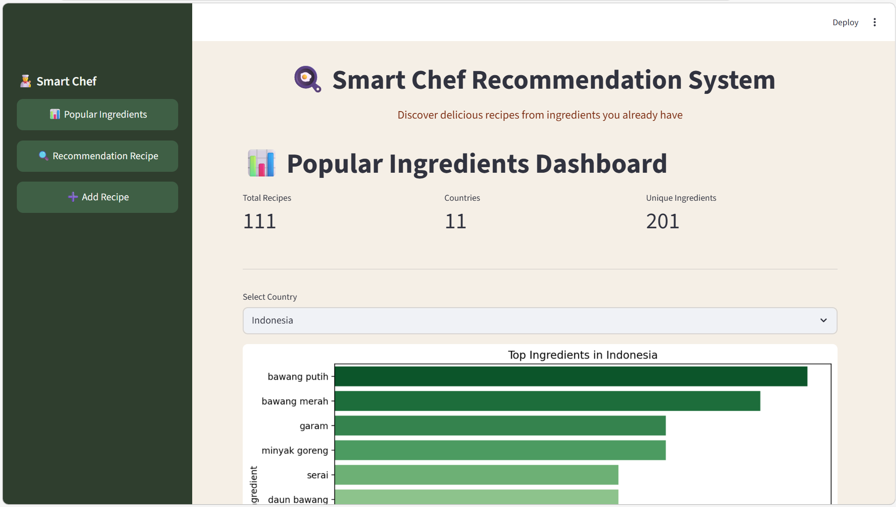
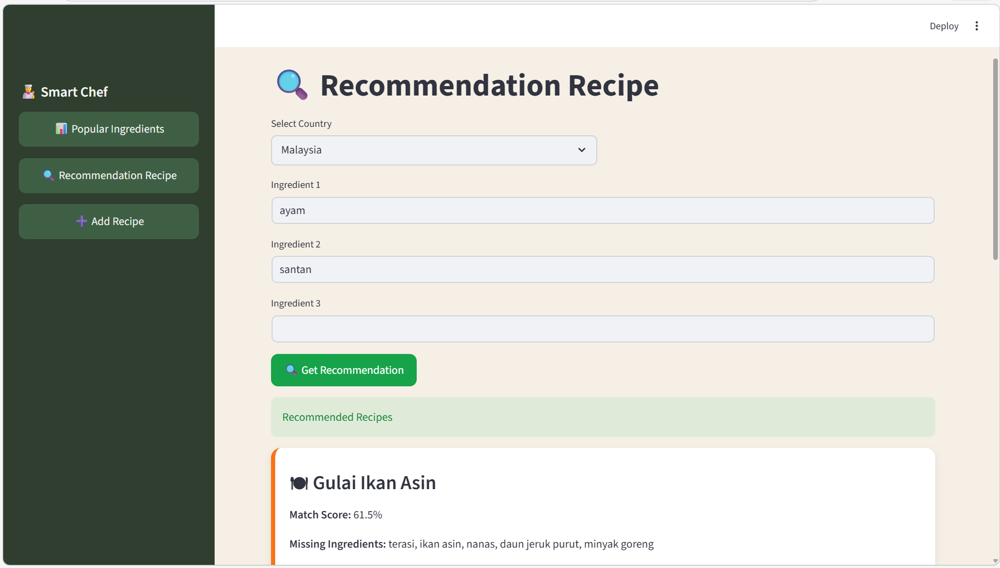
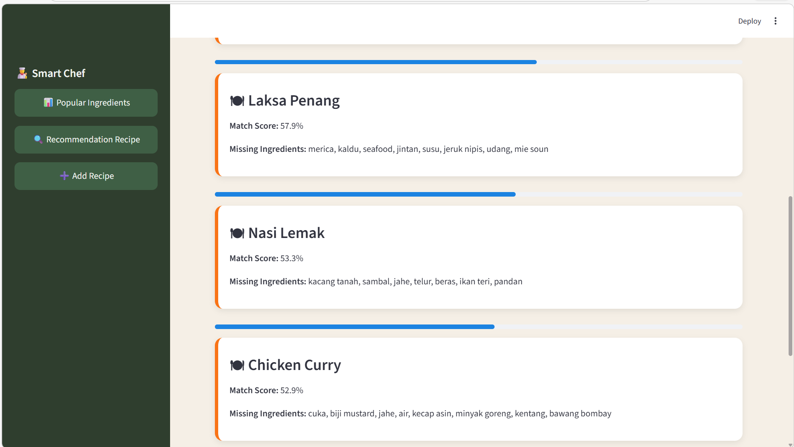
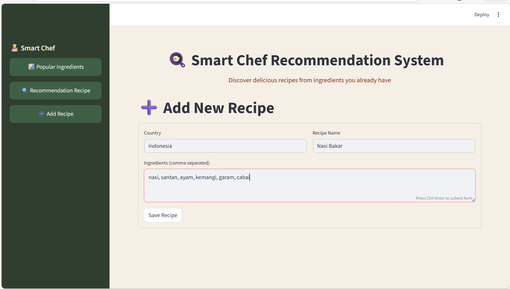

# 🍳 Smart Chef  
### Recommendation System Based on Association Rules (Apriori Algorithm)

Smart Chef is a recipe recommendation system built using **Association Rule Mining (Apriori Algorithm)**.  
This application recommends recipes based on selected country and available ingredients.

---

## 📌 Project Overview

This project applies **Market Basket Analysis** concepts to culinary datasets.  
By analyzing ingredient patterns per country, the system can:

- Identify popular ingredients
- Discover frequent itemsets
- Generate association rules
- Recommend relevant recipes

---

## Features

### 1. Most Popular Ingredients
- Displays Top 10 most frequent ingredients per country
- Visualization using bar charts
  

### 2. Recipe Recommendation
- Input up to 3 ingredients
- Select country
- Get recommended recipes
- See:
  - Match score
  - Missing ingredients
  - Ingredient coverage
   
   

### 3. Add New Recipe
- Add new country
- Add new recipe
- Add ingredients (comma separated)
- Saved automatically to `update_dataset.csv`
  

---

## 🧠 Methodology

This system uses:

- **Apriori Algorithm**
- Frequent Itemset Mining
- Association Rule Learning
- Support-based filtering
- Ingredient similarity scoring

**Dataset Southeast Asian Ingredient Pattern Dataset** 
- https://www.kaggle.com/datasets/retnowardani/southeast-asian-ingredient-pattern-dataset

**Model output includes:**

- `frequent_itemsets_per_country`
- `rules_per_country`
  
---


## ⚙ Installation

1. **Clone the repository**
```bash
git clone https://github.com/retnnoo/Recommendation-System-Based-on-Association-Rules.git
cd Recommendation-System-Based-on-Association-Rules

```

2. **Install dependencies**
```bash
pip install -r requirements.txt

```

3. **Run the application**
```bash
streamlit run smart_chef_app.py

```

4. **Open in your browser**
```bash
http://localhost:8501

```
